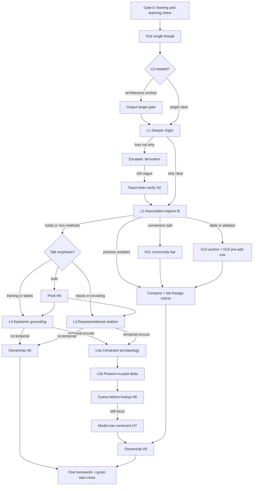

# Reference — Jiawei questioning protocol

This file anchors the trigger-graph workflow and heuristic moves. Use it when updating norms or preparing live questions. **No literature or paper examples** — protocol only.

## Core design principles

| Principle | Practical rule in this skill |
| --- | --- |
| Single-thread | One live Q&A arc = one leverage thread |
| Deeper origin | Ask why introduced, not how computed |
| Teach-then-verify | Rebuild prerequisite chain before doubting |
| Assumption-fail → compare | Soft doubt → mandatory baseline or lab lineage |
| Guess-before-lookup | Written hypothesis before offline investigation |
| Good-start closure | Model constraint → obsolete → one homework → affirm |
| Ownership transfer | Presenter's judgment before deepest critique |
| Bounded depth | Goal-linked follow-ups beat unbounded probing |
| Affirm-then-update | Praise choice, then ask what to update for the present |
| Decision relevance | Discard questions that do not change next experiment or paper choice |
| Output-target first | Name prediction/label before pipeline depth |
| Table anchor | Page/row/column before abstract doubt |
| Pre-add vs post-add | Read baseline row before accepting "X helps" |
| Community benchmark bar | Peers' comparison split must hold, not only convenient split |
| Tables over narrative | Cite cell → shared read → prefer table if mismatch |

## Cognitive protocol (agreements)

| # | Agreement | In one line |
| --- | --- | --- |
| 1 | Single-thread | Say: "What I care most about here is…" |
| 2 | Deeper origin | Why introduced, not how implemented |
| 3 | Teach-then-verify | Rebuild chain → yes/no → then doubt |
| 4 | Assumption-fail → compare | Soft doubt → mandatory compare |
| 5 | Guess-before-lookup | Guess before any offline lookup |
| 6 | Good-start closure | Model constraint → homework → affirm |
| 7 | Ownership transfer (H5) | "What do **you** think?" |
| 8 | Bounded depth | Depth on one thread > many shallow questions |
| 9 | Affirm-then-update | Praise first, then present-vs-past update |
| 10 | Output-target gate | Prediction/label before architecture tour |
| 11 | Table anchor | Slide/table cell before abstract doubt |
| 12 | Pre-add baseline | Row before add vs after add |
| 13 | Community bar | Win on peers' benchmark split, not only home split |

## Layer trigger table

| Layer | Core question | Typical trigger |
| --- | --- | --- |
| **L0 Output-target** | What is **predicted**, labeled, or decided at the **system output**? | Architecture slides without clear supervision target |
| **L1 Deeper origin** | Why was this tool or assumption **introduced**? | Steps/formulas without derivation story |
| **L2 Assumption–regime fit** | Do required premises hold in the **actual** regime? | Theory needs small/local change; practice does large jump; convenient eval split |
| **L3 Representational realism** | Would a practitioner decide using **only** what the system is fed? | Model **input** ≠ human inspection (not the same as L0 output) |
| **L4 Epistemic grounding** | Who is ground truth? Independent check if authority disagrees? | Same experts label and judge |
| **L5a Constraint archaeology** | What **binding constraint** forced the old design? | "Fine at the time" as full defense |
| **L5b Present-vs-past delta** | Which constraint is **gone or weaker**? Legacy design still optimal? | After L5a; before lookup |

### Gate 0 (optional, ≤ ~1 min)

- **Presentation hygiene**: Internal lab bar ≠ external talk bar.
- **Meta-learning probe**: "What did you learn about experimental design or evaluation?"

### Branch: Lab lineage (required when L2 wobbles)

- Same problem as ongoing lab work? What differs?
- On the suspect premise, would our lab's approach win?
- Extendable paper or background reading only?

### Branch: Venue and canon (not L5)

- Picked for recency or because method is canonical?
- Should we trace foundational venues instead of only newest journal?

## Trigger graph

## Reactive playbook

| They say… | You do… | Heuristic |
| --- | --- | --- |
| Explains **how** or efficiency | Escalate to **why / derivation** | H1 |
| "I haven't thought that through" | **Teach** prerequisite chain, then verify | H2 |
| Vague agreement after teach | Soft doubt → demand **comparison** | H3 |
| Keeps re-presenting the paper | Invert to **gap vs alternatives** | H4 |
| Defers to authors/experts | **Ownership transfer** | H5 |
| "It was OK for that era" | L5a → L5b → guess | H6 |
| "I'll look it up later" (no guess) | Insist on **current hypothesis** | H6 |
| Silent / stuck | Model constraint + good-start close | H7 |
| Answers wrong layer | **Pivot** explicitly | H8 |
| Architecture without target | **L0** output prediction/label | — |
| "Adding X improves…" | Read **before-add** row vs after | H10 |
| Strong on home split, weak on peer bar | **Community benchmark** (L2/compare) | H11 |
| Live with slides | Anchor **page/figure/row** first | H12 |
| Talk track vs table disagree | **H12** + tables-over-narrative 3-step; optional reviewer transfer (visible evidence only); **H5** if ownership needed before close | H12 |
| Did not hear / drift | Re-ask shorter; **sync** one sentence | — |

## Decision-relevance gate

Before every question, complete:

> "If the answer were A vs B, the presenter's **next experiment or paper choice** would change because…"

Soft "confidence" alone does not pass the gate.

Optional **PRO** micro-audit: **Premise** → **Reasoning** → **Outcome**. Ask which **P** is assumed but never shown.

## Question bank (generic stems)

Rewrite X/Y for the domain. Never anchor to specific papers or past seminars.

**L0**
- "Before the blocks — **what exactly** is the model output? What is being predicted or labeled?"
- "Walk me to the **last arrow** on the diagram: what quantity comes out?"

**L1**
- "I follow **how** you use X. I want **why** the authors landed on X rather than Y."
- "Can we go one step back — **where does this assumption come from**?"

**L2**
- "This derivation needs condition ○○. Does that hold in your **actual** setting?"
- "If the base premise is shaky, **what would you compare against**?"

**L3**
- "Would someone who does this task rely on **only** the quantities you feed the model?"
- "Does the encoding match **practice-level** judgment?"

**L4**
- "Who defines the standard? If they say it's wrong, **what independent check** exists?"
- "Would multiple raters change your confidence?"

**L5a**
- "What **constraint** forced that design back then?"
- "What could they **not** do at the time?"

**L5b**
- "What's **different now**? Is the old design still reasonable?"
- "Before looking anything up — write your **current guess**."

**Ownership (H5)**
- "What do **you** think — is that reasonable?"
- "What would **you** try first to improve this?"

**Closure (H7)**
- "This opens a good thread — follow up on ○○ (one item only)."

**Table / ablation (H10–H12)**
- "On **this row**, before X was added, the number is already ○○ — why add X if it goes **up**?"
- "The win is on split A; on **the split everyone compares on**, what happens?"
- "Let's look at **page N, this row** together — does your reading match mine?"

**Reviewer transfer (optional, live — visible evidence only)**
- "If I were reviewing **from this slide**, the first line I'd write is… — do you think that's fair?"
- "The **data** on the slide already says ○○; I'd want that resolved before the story."

## Stop rules

1. **Decision-relevance stop** — Next question would not change next experiment or paper choice → do not ask.
2. **Thread-opened stop** — Shaky premise + comparison axis + one homework → live Q may end.
3. **Saturation stop** — Answers repeat → close.
4. **Depth timebox** — One deep thread per live turn; prefer ≤3 live stems unless user asked `deep`.
5. **Do-not-stop-yet** — L2/L3 failed without comparison or test → name one falsifiable step first.
6. **Comparison-without-premise guard** — No **external** baseline hunt until L2 (or L3 if input-focused) wobbles. **On-slide** H12/H10/H11 reads that surface the wobble are allowed and preferred.
7. **Cell-agreed stop** — After H12 agreement (or H11 named), do not re-anchor the same table; move thread or close.

## Mentor checklist

Before live Q:

- [ ] Talk-definition packet written
- [ ] Single thread declared
- [ ] Gate 0 only if needed (≤ ~1 min)
- [ ] Mode chosen (`standard` / `deep` / …)

During Q:

- [ ] Decision-relevance gate on each question (experiment / paper choice)
- [ ] L0 if architecture unclear
- [ ] H12 if live with slides / numbers
- [ ] H10 if "added X" / ablation claimed
- [ ] H11 if home-split win vs community bar
- [ ] H2 if "haven't thought it through"
- [ ] H3/H4 + lab lineage if L2 wobbles
- [ ] H5 before deepest push
- [ ] H6 / L5 only if temporal excuse
- [ ] H8 if wrong layer answered
- [ ] Stop rules considered (thread-opened / saturation / timebox / cell-agreed)

Before close:

- [ ] Exactly one homework
- [ ] H7 or H9 affirm
- [ ] Self-check in SKILL.md passed

## Questioning quality rubric

| Dimension | Weak (1) | Strong (3) |
| --- | --- | --- |
| Thread focus | Many parallel doubts | One declared leverage line |
| Output-target | Architecture tour, unclear prediction | L0 clear or explicitly N/A |
| Origin depth | How/implementation only | Derivation and why introduced |
| Premise handling | Vague unease | L2 test + compare if wobble |
| Table discipline | Narrative over numbers | H12 cite + shared read; H10/H11 when triggered |
| Ownership | Mentor judges alone | Presenter commits before deep critique |
| Temporal logic | "Old paper" dismissal or forced L5 | L5 only on temporal excuse; guess before lookup |
| Closure | Question pile | One homework + good-start affirm |
