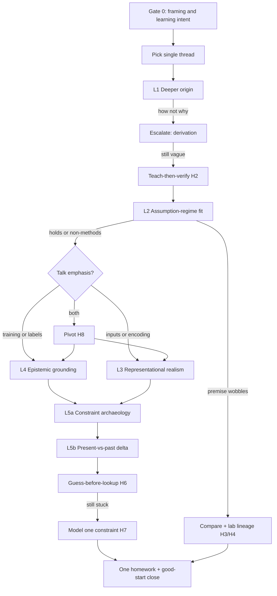

# Reference — Jiawei questioning protocol

This file anchors the trigger-graph workflow and heuristic moves. Use it when updating norms or preparing live questions. **No literature or paper examples** — protocol only.

## Core design principles

| Principle | Practical rule in this skill |
| --- | --- |
| Single-thread | One live Q&A arc = one leverage thread |
| Deeper origin | Ask why introduced, not how computed |
| Teach-then-verify | Rebuild prerequisite chain before doubting |
| Assumption-fail → compare | Soft doubt → mandatory baseline or lab lineage |
| Guess-before-lookup | Written hypothesis before offline investigation |
| Good-start closure | Model constraint → obsolete → one homework → affirm |
| Ownership transfer | Presenter's judgment before deepest critique |
| Bounded depth | Goal-linked follow-ups beat unbounded probing |
| Affirm-then-update | Praise choice, then ask what to update for the present |
| Decision relevance | Discard questions that do not change next action |

## Cognitive protocol (nine agreements)

| # | Agreement | In one line |
| --- | --- | --- |
| 1 | Single-thread | Say: "What I care most about here is…" |
| 2 | Deeper origin | Why introduced, not how implemented |
| 3 | Teach-then-verify | Rebuild chain → yes/no → then doubt |
| 4 | Assumption-fail → compare | Soft doubt → mandatory compare |
| 5 | Guess-before-lookup | Guess before any offline lookup |
| 6 | Good-start closure | Model constraint → homework → affirm |
| 7 | Ownership transfer (H5) | "What do **you** think?" |
| 8 | Bounded depth | Depth on one thread > many shallow questions |
| 9 | Affirm-then-update | Praise first, then present-vs-past update |

## Layer trigger table

| Layer | Core question | Typical trigger |
| --- | --- | --- |
| **L1 Deeper origin** | Why was this tool or assumption **introduced**? | Steps/formulas without derivation story |
| **L2 Assumption–regime fit** | Do required premises hold in the **actual** regime? | Theory needs small/local change; practice does large jump |
| **L3 Representational realism** | Would a practitioner decide using **only** what the system is fed? | Model input ≠ human inspection |
| **L4 Epistemic grounding** | Who is ground truth? Independent check if authority disagrees? | Same experts label and judge |
| **L5a Constraint archaeology** | What **binding constraint** forced the old design? | "Fine at the time" as full defense |
| **L5b Present-vs-past delta** | Which constraint is **gone or weaker**? Legacy design still optimal? | After L5a; before lookup |

### Gate 0 (optional, ≤ ~1 min)

- **Presentation hygiene**: Internal lab bar ≠ external talk bar.
- **Meta-learning probe**: "What did you learn about experimental design or evaluation?"

### Branch: Lab lineage (required when L2 wobbles)

- Same problem as ongoing lab work? What differs?
- On the suspect premise, would our lab's approach win?
- Extendable paper or background reading only?

### Branch: Venue and canon (not L5)

- Picked for recency or because method is canonical?
- Should we trace foundational venues instead of only newest journal?

## Trigger graph

## Reactive playbook

| They say… | You do… | Heuristic |
| --- | --- | --- |
| Explains **how** or efficiency | Escalate to **why / derivation** | H1 |
| "I haven't thought that through" | **Teach** prerequisite chain, then verify | H2 |
| Vague agreement after teach | Soft doubt → demand **comparison** | H3 |
| Keeps re-presenting the paper | Invert to **gap vs alternatives** | H4 |
| Defers to authors/experts | **Ownership transfer** | H5 |
| "It was OK for that era" | L5a → L5b → guess | H6 |
| "I'll look it up later" (no guess) | Insist on **current hypothesis** | H6 |
| Silent / stuck | Model constraint + good-start close | H7 |
| Answers wrong layer | **Pivot** explicitly | H8 |

## Decision-relevance gate

Before every question, complete:

> "If the answer were A vs B, the presenter's **next experiment, paper choice, or confidence** would change because…"

Optional **PRO** micro-audit: **Premise** → **Reasoning** → **Outcome**. Ask which **P** is assumed but never shown.

## Question bank (generic stems)

Rewrite X/Y for the domain. Never anchor to specific papers or past seminars.

**L1**
- "I follow **how** you use X. I want **why** the authors landed on X rather than Y."
- "Can we go one step back — **where does this assumption come from**?"

**L2**
- "This derivation needs condition ○○. Does that hold in your **actual** setting?"
- "If the base premise is shaky, **what would you compare against**?"

**L3**
- "Would someone who does this task rely on **only** the quantities you feed the model?"
- "Does the encoding match **practice-level** judgment?"

**L4**
- "Who defines the standard? If they say it's wrong, **what independent check** exists?"
- "Would multiple raters change your confidence?"

**L5a**
- "What **constraint** forced that design back then?"
- "What could they **not** do at the time?"

**L5b**
- "What's **different now**? Is the old design still reasonable?"
- "Before looking anything up — write your **current guess**."

**Ownership (H5)**
- "What do **you** think — is that reasonable?"
- "What would **you** try first to improve this?"

**Closure (H7)**
- "This opens a good thread — follow up on ○○ (one item only)."

## Stop rules

1. **Decision-relevance stop** — Next question would not change next action → do not ask.
2. **Thread-opened stop** — Shaky premise + comparison axis + one homework → live Q may end.
3. **Saturation stop** — Answers repeat → close.
4. **Depth timebox** — One deep thread per live turn.
5. **Do-not-stop-yet** — L2/L3 failed without comparison or test → name one falsifiable step first.
6. **Comparison-without-premise guard** — No baselines until L2 (or L3 if input-focused) wobbles.

## Mentor checklist

Before live Q:

- [ ] Talk-definition packet written
- [ ] Single thread declared
- [ ] Gate 0 only if needed (≤ ~1 min)

During Q:

- [ ] Decision-relevance gate on each question
- [ ] H2 if "haven't thought it through"
- [ ] H3/H4 + lab lineage if L2 wobbles
- [ ] H5 before deepest push
- [ ] H6 if temporal excuse
- [ ] H8 if wrong layer answered

Before close:

- [ ] Exactly one homework
- [ ] H7 or H9 affirm
- [ ] Self-check in SKILL.md passed

## Questioning quality rubric

| Dimension | Weak (1) | Strong (3) |
| --- | --- | --- |
| Thread focus | Many parallel doubts | One declared leverage line |
| Origin depth | How/implementation only | Derivation and why introduced |
| Premise handling | Vague unease | L2 test + compare if wobble |
| Ownership | Mentor judges alone | Presenter commits before deep critique |
| Temporal logic | "Old paper" dismissal | L5a constraint → L5b delta → guess |
| Closure | Question pile | One homework + good-start affirm |
